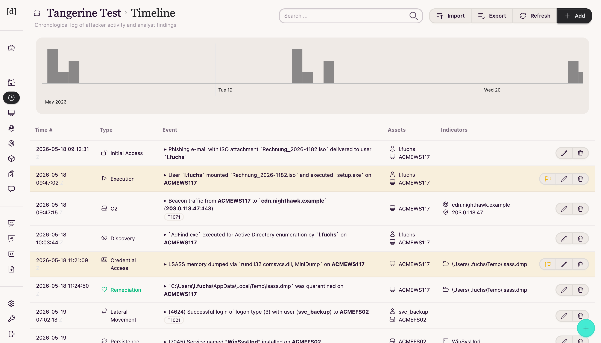
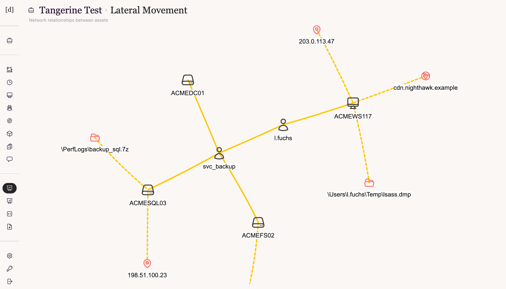
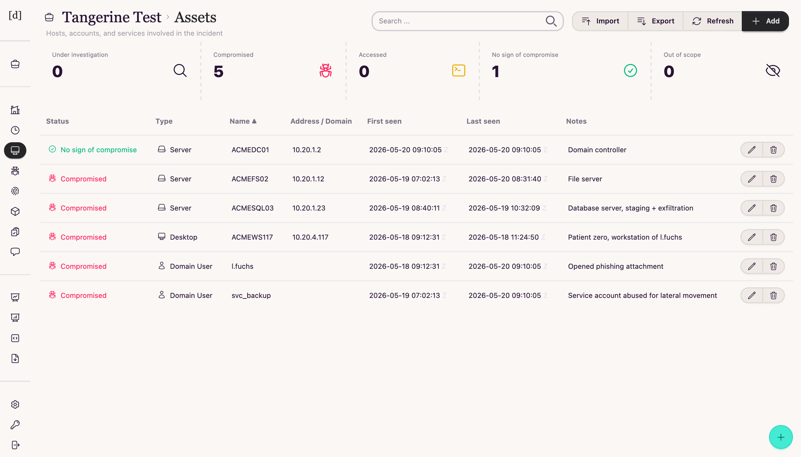
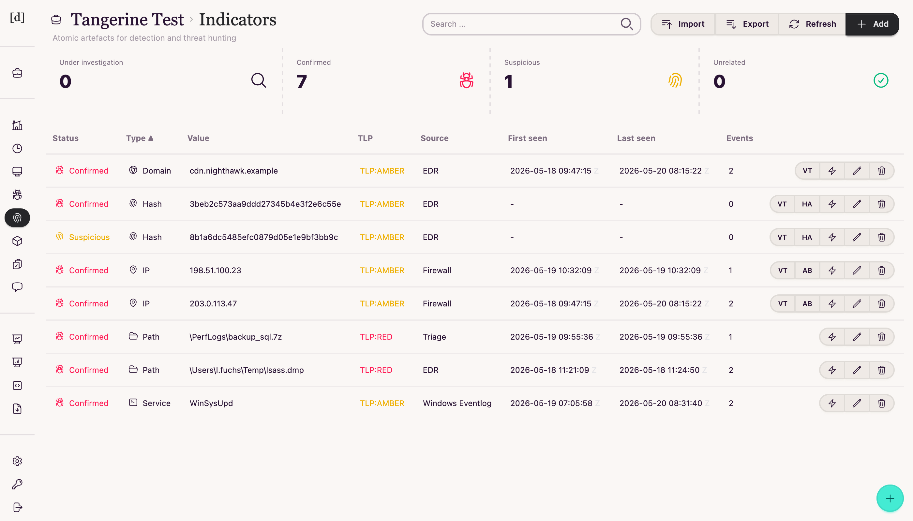

# Dagobert

**A collaborative platform for incident response**

Dagobert gives incident response teams a shared workspace for forensic
investigations: technical findings, timelines, tasks, and notes live in one
place, and reports are generated from your own document templates instead of
being written by hand at 2am.

It is inspired by [IRIS](https://github.com/dfir-iris/iris-web) and
[Aurora Incident Response](https://github.com/cyb3rfox/Aurora-Incident-Response),
but takes a deliberately lighter approach: where IRIS runs as a multi-container
Python stack with PostgreSQL, Dagobert is a single Go binary backed by SQLite —
one container, no external database, and a backup is a file copy. Unlike
Aurora's desktop, file-locking model, Dagobert is web-based, so the whole team
can work on a case concurrently.



| Lateral movement graph | Assets | Indicators |
|---|---|---|
| [](docs/screenshot-graph.png) | [](docs/screenshot-assets.png) | [](docs/screenshot-indicators.png) |

## Features

- **Multi-case management** — separate workspaces per investigation, with
  per-case access control (role-based, managed in the UI).
- **Timeline** — a unified chronology of attacker activity and investigative
  actions, with MITRE ATT&CK technique mapping.
- **Evidence, indicators & malware tracking** — structured records for assets,
  IOCs, collected evidence, and malware samples, with CSV import/export.
- **Lateral movement graph** — visualize the relationships between
  compromised hosts, accounts, and indicators as the attack unfolds.
- **Tasks** — assign work to team members with owners and due dates.
- **Notes & comments** — document findings as you go, visible to the whole team.
- **Report generation** — render Word, Excel/Calc, and Writer templates
  (`.docx`, `.ods`, `.odt`) from case data; bring your own corporate template.
- **Evidence processing** — run [Hayabusa](https://github.com/Yamato-Security/hayabusa)
  (EVTX triage) and [Plaso](https://github.com/log2timeline/plaso)
  (super-timelines) against uploaded evidence as background jobs.
- **Timesketch integration** — upload timelines to
  [Timesketch](https://github.com/google/timesketch) or import events back for
  analysis.
- **Hooks** — trigger automations when records are created or updated,
  with conditions written as [expr](https://expr-lang.org/) expressions.
- **MCP server** — expose case data (cases, timeline, assets, indicators,
  malware, notes, tasks) read-only to MCP clients over an authenticated
  HTTP endpoint.
- **Authentication** — local users or any OIDC provider (tested with
  Azure AD), with optional auto-provisioning.

## Getting Started

### Prerequisites

- Docker and Docker Compose (v2+)

### Installation

1. Clone the repository:

   ```sh
   git clone https://github.com/sprungknoedl/dagobert
   cd dagobert
   ```

2. Configure the environment:

   ```sh
   cp dagobert.env.example dagobert.env
   $EDITOR dagobert.env
   ```

3. Start the stack:

   ```sh
   docker compose up -d
   ```

4. Run the database migrations:

   ```sh
   docker compose exec app dagobert db
   ```

5. Create the first user:

   ```sh
   docker compose exec app dagobert create-user <USERNAME>
   ```

Dagobert is now available at <http://localhost:8080>.

Two Docker images are published: `sprungknoedl/dagobert` (slim, the app only)
and `sprungknoedl/dagobert-full` (app plus Plaso and Hayabusa). The compose
file defaults to the full image so evidence processing works out of the box.
Jobs run in-process, with the tool commands configured via the `MODULE_*`
environment variables — the full image presets these to the bundled tools, so
leave them unset in `dagobert.env` unless you want to override them. The
Timesketch importer is built into the app itself and configured solely via
the `TIMESKETCH_*` variables.

> [!WARNING]
> Do not expose Dagobert directly to the internet. Always deploy it behind an
> HTTPS reverse proxy (nginx, Apache, traefik, caddy, ...) and restrict access
> to your team.

## Configuration

All runtime configuration is done through environment variables — see
`dagobert.env.example` for an annotated starting point and the
[Configuration reference](https://github.com/sprungknoedl/dagobert/wiki/Configuration)
in the wiki for the complete list.

### MCP access

Dagobert serves a read-only [MCP](https://modelcontextprotocol.io/) endpoint at
`/mcp`. Create an API key of type *MCP* in the UI, then point an MCP client at
it. For Claude Code:

```sh
claude mcp add --transport http dagobert https://<dagobert>/mcp --header "X-API-Key: <API KEY>"
```

## Development

You need Go 1.25+. TailwindCSS is built with the standalone CLI — `make
build-web` downloads the pinned binary and daisyUI plugin files automatically, no Node.js required.

```sh
make build   # build CSS + templ templates + Go binary
make run     # dev server with hot reload (air)
make check   # templ generate + build + vet + test + gofmt — run before committing
```

HTML templates are [templ](https://templ.guide/) files in `app/views/`; run
`go tool templ generate` (included in `make build-go` and `make check`) after
editing them. Database migrations are plain SQL files in
`app/model/migrations/`, applied with `dagobert db`.

## Contributing

Contributions of any kind — code, documentation, design, bug reports — are
welcome:

1. Fork the repository
2. Create a feature branch: `git checkout -b feature/your-idea`
3. Submit a PR with a clear description

For questions and bug reports, please open a
[GitHub issue](https://github.com/sprungknoedl/dagobert/issues).

## License

Dagobert is released under the [MIT License](LICENSE).
